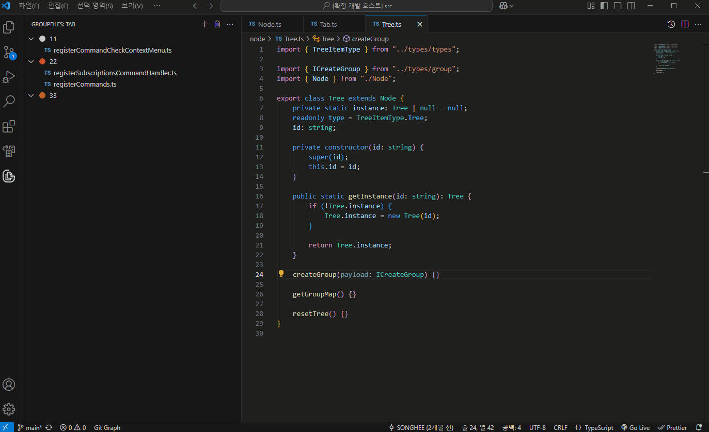
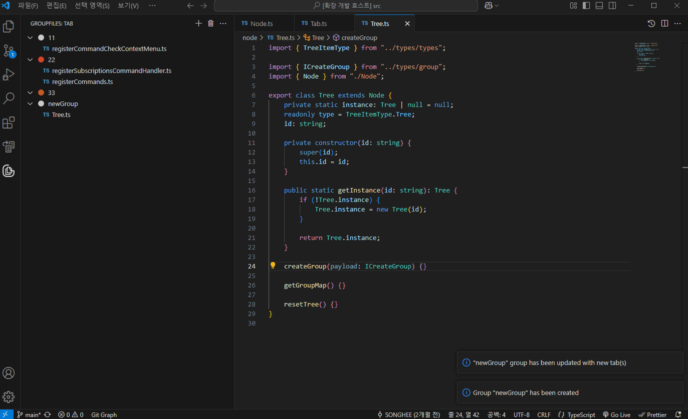
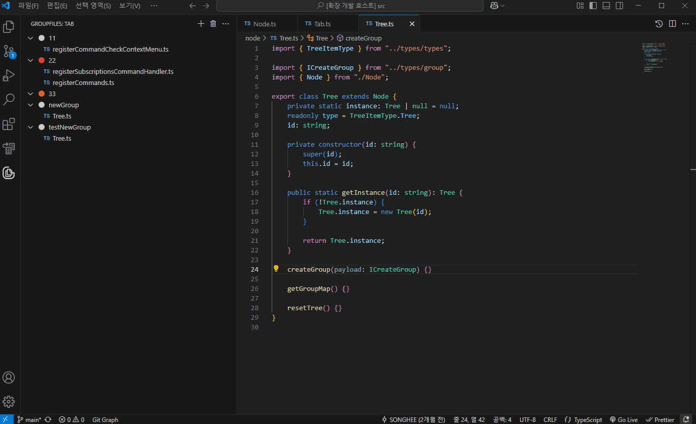
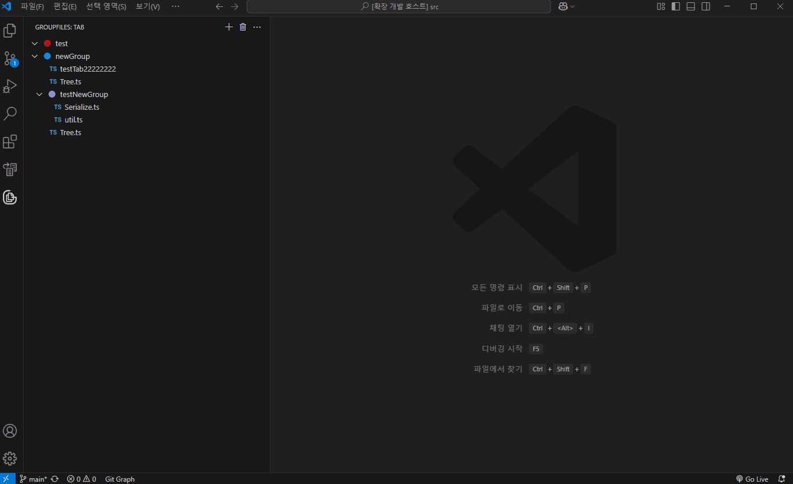
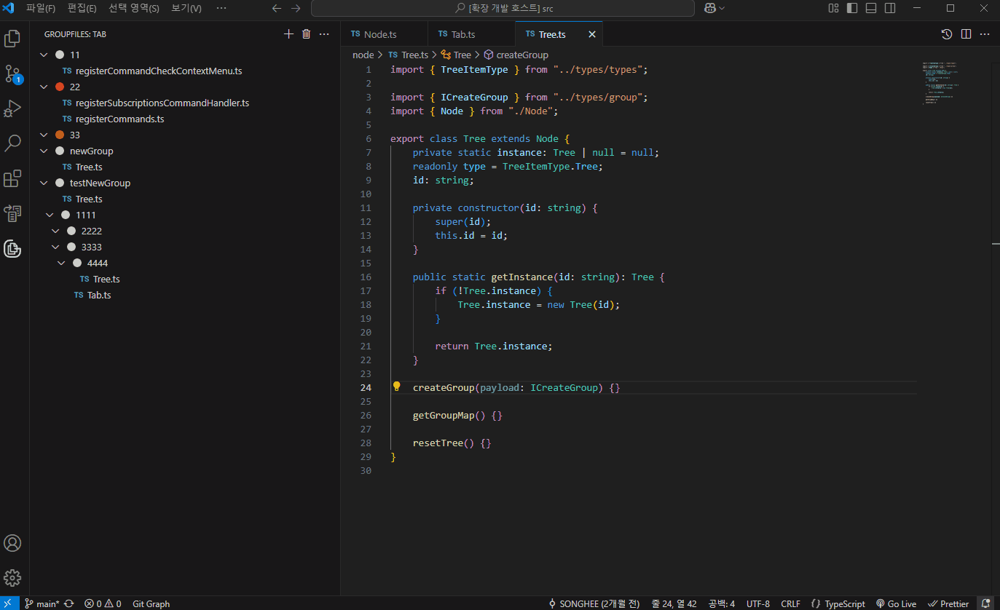
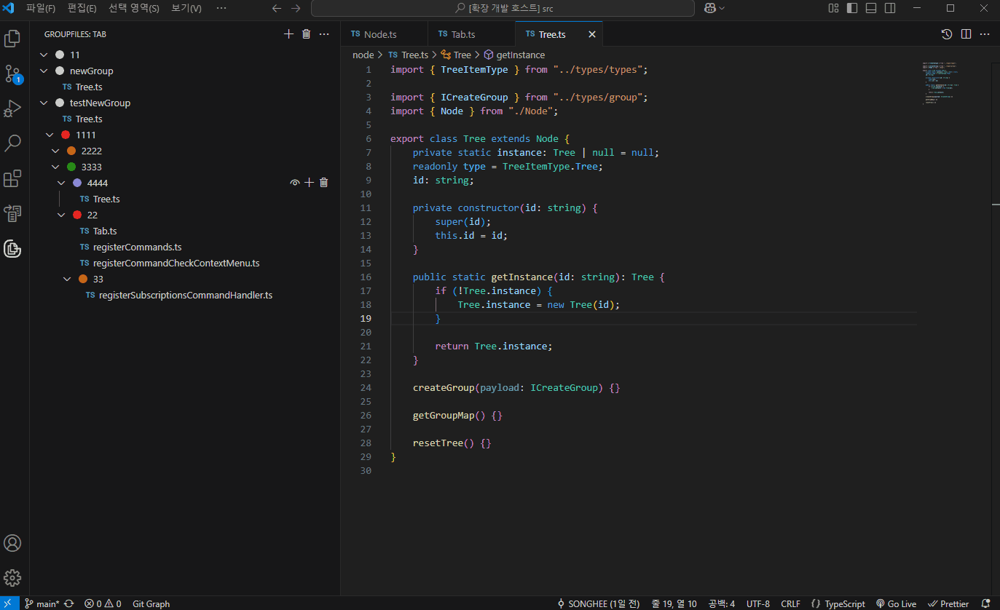
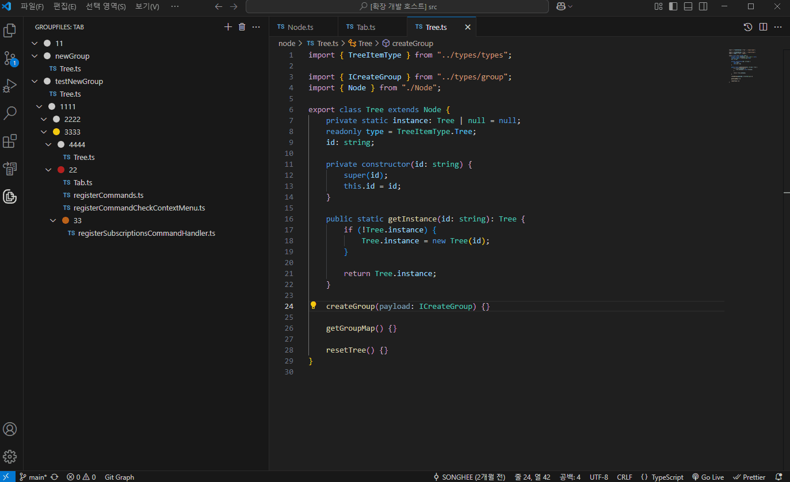

# GroupFiles

`GroupFiles` is a VS Code extension for managing file groups and tabs.

It lets you organize your workspace with groups, tabs, and drag-and-drop functionality.

## Features

### Group Management

-   **Create, delete, and update groups** (name, description, color).
-   **Create nested groups**.

### Tab Management

-   **Add, update, and delete tabs** within groups.

### View Control

-   Toggle **description** and **alias** visibility.
-   Toggle **group collapsed** state.

### Workspace Features

-   Open **all files** within a group.
-   Create a new **workspace** based on tab references.

### Drag & Drop

-   **Move tabs** between groups.
-   **Reorder groups** and tabs.

## Demos

**Create new Group and Tab**

**Create Group and Inner Group**

**Open Group Inner Tab**

**Group and Tab Drag and Drop**

**Update Description**

**Update Icon**

**Update Group Name and Tab Alias**

